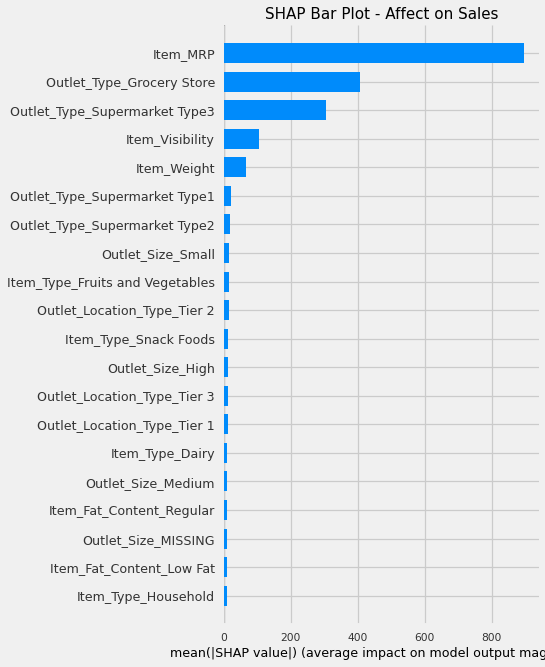
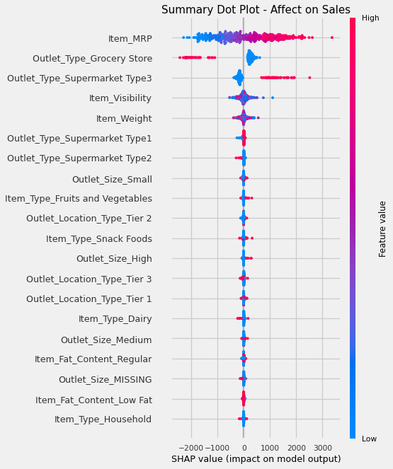
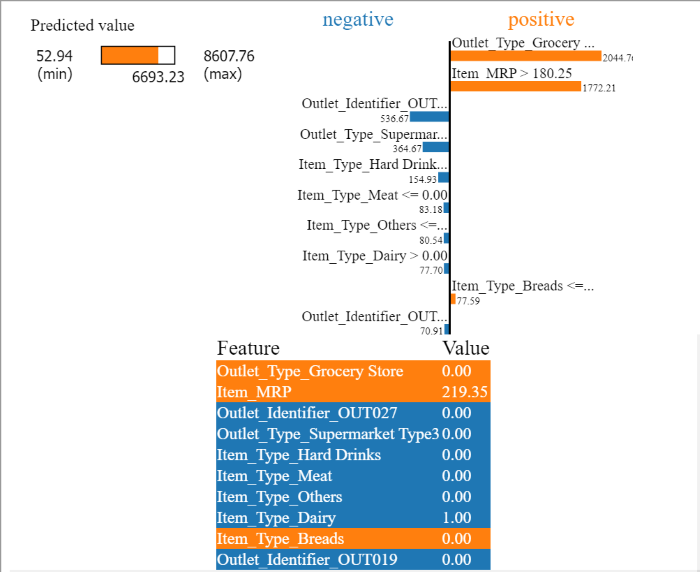
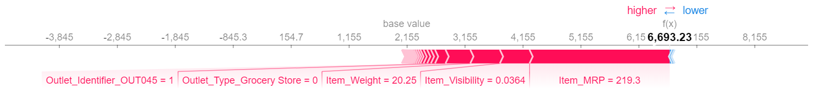
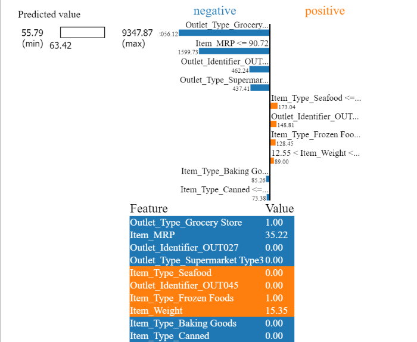
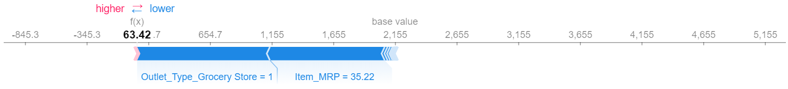

# Prediction of Product Sales
### Author Information:

- **Name**: Peter Tran
- **Email**: hdtran103@gmail.com

---

### Dataset:

- **[Download Dataset (.csv)](https://drive.google.com/file/d/1syH81TVrbBsdymLT_jl2JIf6IjPXtSQw/view)**
- **[Source of Data](https://datahack.analyticsvidhya.com/contest/practice-problem-big-mart-sales-iii/)**

---

### Data Dictionary:

A detailed explanation of dataset columns can be found in the [Data Dictionary](https://github.com/hdtran103/Project-1-Prediction-of-Product-Sales/blob/main/Data/Data%20Dictionary%20(80%25).png)

---

### Project Structure:

1. **Exploratory Data Analysis (EDA)**:
    - Understanding the distribution of numerical and categorical variables.
    - Analyzing the relationships between different variables and sales.

2. **Data Cleaning & Preprocessing**:
    - Handling missing values.
    - Encoding categorical variables.
    - Feature scaling and normalization.

3. **Model Building**:
    - Partitioning the data into training and testing sets.
    - Training different models including Linear Regression, Decision Tree, and Random Forest.
    - Evaluating models based on metrics like MAE, RMSE, and R^2.

4. **Model Evaluation & Selection**:
    - Comparing the performance of different models.
    - Identifying the model with the best predictive accuracy.

5. **Feature Importance Analysis**:
    - Understanding which features have the most impact on sales predictions.

6. **Model Interpretability using SHAP**:
    - Providing global and local explanations for the model predictions.

---

### Key Insights from EDA:

1. **Item MRP and Outlet Sales Relationship**:
    - Higher priced items generate more revenue despite fewer units sold. The graph illustrates how as the MRP (Maximum Retail Price) increases, the overall sales also increase.
    

2. **Sales Distribution by Item Type**:
    - 'Fruits and Vegetables' and 'Snack Foods' are the leading categories in sales. This graph showcases the total sales for each item type.
    

3. **Outlet Characteristics Impact on Sales**:
    - Varieties in Outlet_Type and size show a noticeable difference in sales across different cities. The graph depicts how sales vary with different outlet characteristics.
    

---

### Feature Importance Analysis:

1. **Linear Regression**:
    - Top 3 Impactful Features:
        - 'Outlet_Type_Supermarket Type1'
        - 'Outlet_Identifier_OUT027'
        - 'Outlet_Type_Supermarket Type3'
    - **Plot of Coefficients**:
        
    - **Interpretation**:
        - The coefficients signify the change in the dependent variable (Sales) with a one-unit change in the respective feature, keeping other features constant.
        - Features with higher coefficients have a higher influence on the sales prediction. For instance, outlets of type 'Supermarket Type1' have a strong positive relationship with the sales, meaning sales tend to be higher in these outlets.

2. **Random Forest**:
    - **Comparison of Default Importances and Permutation Importances**:
        - Top Features include 'Item_MRP', 'Outlet_Type_Grocery Store', and 'Item_Visibility'.
    - **Plots of Feature Importances**:
        
        
    - **Interpretation**:
        - The 'Item_MRP' (Maximum Retail Price) has the highest importance in predicting sales according to the Random Forest model, implying that the price of the item is a significant determinant of sales.
        - 'Outlet_Type_Grocery Store' also holds significant importance, suggesting the type of outlet impacts sales prediction notably. For instance, grocery stores might have lower sales figures compared to other outlet types.
        - The comparison between default and permutation importances helps in understanding the stability and reliability of the feature importances derived from the model.

---
### Model Explanation using SHAP:

- **Global Explanation**:
    - Summary plots demonstrate the influence of 'Item_MRP', 'Outlet_Type_Grocery Store', and 'Outlet_Identifier_OUT027' on the model predictions, giving an overall understanding of feature impact.
    
    

- **Local Explanation**:
    - High and Low sale stores comparison provides insights into the varying factors influencing sales figures across different outlets, displaying how individual predictions can be interpreted.
    
    

---

### SHAP Analysis:

SHAP values help in understanding the contribution of each feature to the prediction made by the model. Below are the SHAP summary plots from our analysis with interpretations:

1. **SHAP Summary (Bar Plot)**:
    
    - **Comparison with Feature Importance**:
        - Similar to the feature importance derived from the Random Forest model, 'Item_MRP' stands out as the most impactful feature according to SHAP values.
        - However, SHAP analysis provides a more detailed insight into how each feature contributes to the predictions, allowing us to observe the positive or negative effect of features on the model's output.

2. **SHAP Summary Plot (Dot Dot)**:
    
    - **Interpretation of Top 3 Most Important Features**:
        1. **Item_MRP**:
            - Higher values of 'Item_MRP' lead to higher predictions in sales, indicating that items with higher maximum retail price contribute to higher sales.
        2. **Outlet_Type_Grocery Store**:
            - The presence of this feature (i.e., being a Grocery Store) tends to lower the sales prediction, suggesting that grocery stores have lower sales compared to other outlet types.
        3. **Item_Visibility**:
            - Higher values of 'Item_Visibility' tend to lower the sales prediction. This could indicate that items that are more visible are likely to be on sale or discounted, leading to lower overall sales revenue.

---

---

### Selected Individual Examples for Visualization:

We selected two distinct examples to visualize, which represent different scenarios in our data. These visualizations help to understand how the model is making predictions at the individual level, and what features are driving these predictions.

#### Example 1:
- **Reason for Selection**: 
    - This example represents a product with high sales, which allows us to explore what features contribute to higher sales predictions.

1. **LIME Tabular Explanation**:
    
    - **Interpretation**:
        - The model heavily weighs the 'Item_MRP' and 'Outlet_Type_Supermarket Type3' positively, driving higher sales prediction for this example. Lower 'Item_Visibility' also contributes positively to the sales prediction.

2. **SHAP Force Plot**:
    
    - **Interpretation**:
        - Similar to LIME, SHAP also highlights 'Item_MRP' as a significant positive contributor. However, SHAP provides a more detailed breakdown of how each feature pushes the prediction higher or lower.

#### Example 2:
- **Reason for Selection**: 
    - This example represents a product with lower sales, providing insights into what features contribute to lower sales predictions.

1. **LIME Tabular Explanation**:
    
    - **Interpretation**:
        - Here, 'Outlet_Type_Grocery Store' heavily negatively influences the prediction. Lower 'Item_MRP' also contributes to the lower sales prediction.

2. **SHAP Force Plot**:
    
    - **Interpretation**:
        - 'Outlet_Type_Grocery Store' and lower 'Item_MRP' are significant negative contributors to the prediction, similar to the LIME explanation. SHAP also displays a distribution of feature effects, making it easier to see how these features compare to others in the dataset.

---

### Conclusion:
Through thorough analysis, feature importance examination, and model interpretability, the project provides a solid framework for predicting product sales. The iterative approach towards model improvement and interpretation leads to better and more accurate sales predictions.

---

### Contact Information:
For further inquiries or collaboration, feel free to reach out at hdtran103@gmail.com.

---
